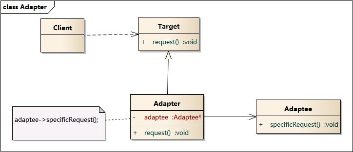

# 适配器模式

适配器模式（Adapter Pattern）将一个接口转换成客户希望的另一个接口，适配器模式使接口不兼容的那些类可以一起工作。

> 适配器模式别名为包装器。适配器模式既可以作为类结构型模式，也可以作为对象结构型模式。

## 示意图



## 示例代码

```typescript
// 新接口
interface Target {
  request(): void;
}

// 旧接口
class Adaptee {
  specificRequest() {
    return 'Specific Request';
  }
}

class Adapter extends Target {
  private adaptee: Adaptee;

  constructor(adaptee: Adaptee) {
    this.adaptee = adaptee;
  }

  request() {
    // 适配旧接口方法到新接口方法
    // ...
    return this.adaptee.specificRequest();
  }
}
```

## 优缺点

### 优点

- 将目标类和适配者类解耦，通过引入一个适配器类来重用现有的适配者类，而无须修改原有代码。
- 增加了类的透明性和复用性，将具体的实现封装在适配者中，对于客户端而言是透明的，而且提高了适配者的复用性。
- 灵活性和扩展性都非常好，可以在不修改原有代码的基础上增加新的适配器类，符合“开闭原则”。

### 缺点

- 在调用转换接口与适配类之间增加一层转换过程，可能会有一定的性能损耗。

## 应用场景

- 在软件系统中，由于环境的变化，经常需要将一些现存的对象放入新的环境中，而新环境要求的接口是这些现存对象所不满足的。适配器模式使得现存对象不需要修改就可以适应新的环境。
- 在遗留代码复用、第三方类库使用，修改一个接口时，不希望或者不值得去重写整个接口以及与之相关联的引用代码。

## 参考

- [适配器模式 — Graphic Design Patterns](https://design-patterns.readthedocs.io/zh-cn/latest/structural_patterns/adapter.html)
