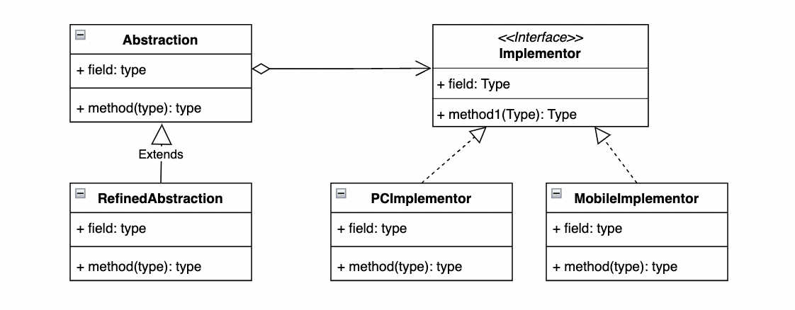

# 桥接模式

桥接模式（Bridge Pattern）将抽象部分与它的实现部分分离，使它们都可以独立地变化。

> 桥接模式是一种对象结构型模式，又称为柄体模式或接口(Interface)模式。

## 示意图



## 示例代码

```typescript
interface Implementor {
  operationImpl(): void;
}

class PCImplementor implements Implementor {
  public operationImpl() {
    console.log('PC 具体实现');
  }
}

class MobileImplementor implements Implementor {
  public operationImpl() {
    console.log('Mobile 具体实现');
  }
}

abstract class Abstraction {
  protected implementor: Implementor;

  constructor(implementor: Implementor) {
    this.implementor = implementor;
  }

  abstract operation(): void;
}

class RefinedAbstraction extends Abstraction {
  public operation() {
    this.implementor.operationImpl();
  }
}

// usage
const refAbstractionA = new RefinedAbstraction(new PCImplementor());
refAbstractionA.operation();

const refAbstractionB = new RefinedAbstraction(new MobileImplementor());
refAbstractionB.operation();
```

## 优缺点

### 优点

- 使用“对象间的组合关系”解耦了抽象和实现之间固有的绑定关系，改变一个对象的结构不会影响另一个的稳定性，提高了系统的灵活性。

### 缺点

- 桥接模式的引入会增加系统的理解与设计难度，由于聚合关联关系建立在抽象层，要求开发者针对抽象进行设计与编程。

## 适用场景

- 由于某些类型的固有的实现逻辑，导致它们具有两个变化的维度，乃至多个纬度的变化。
- 相同业务在不同平台上的实现。
