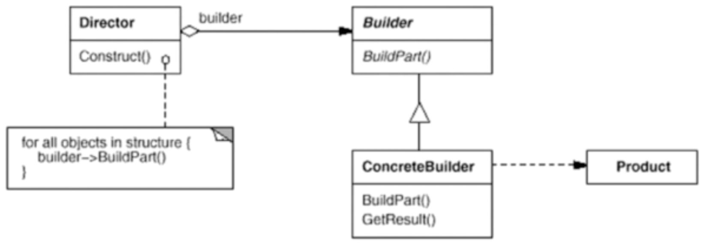

# 建造者模式

将一个复杂对象的构建与其表示相分离，使得同样的构建过程（稳定）可以创建不同的表示（变化）。

## 示意图



## 示例代码

```ts
abstract class Product {}

abstract class ProductBuilder {
  protected product: Product;

  public constructor(product: Product) {
    this.product = product;
  }

  protected abstract buildPartA(): void;
  protected abstract buildPartB(): void;
  protected abstract buildPartC(): void;
  // ...

  public getResult(): Product {
    return this.product;
  }
}

class ProductDirector {
  public builder: ProductBuilder;

  constructor(builder: ProductBuilder) {
    this.builder = builder;
  }

  public construct(): void {
    builder.buildPartA();
    builder.buildPartB();
    builder.buildPartC();
    // ...

    return builder.getResult();
  }
}

class ConcreteProduct {}

class ConcreteProductBuilder extends ProductBuilder {
  public buildPartA() {}

  public buildPartB() {}

  public buildPartC() {}
}

const product = new ConcreteProduct();
const director = new ProductDirector(new ConcreteProductBuilder(product));
director.construct();
// ...
```

## 优缺点

### 优点

- 可以将复杂对象的创建过程封装在 Director 类中，通过调用 Director 类的构造函数来一步步构建出复杂的对象。
- 客户端不必知道产品内部组成的细节，便于控制细节风险。
- 在建造者模式中，客户端可以指定复杂对象的部分或全部的创建过程。
- 增加新的具体建造者类很方便，无需修改原有类库代码，符合“开闭原则”。

### 缺点

- 产品的组成部分必须相同，这限制了其使用范围。
- 如果产品的内部变化复杂，则需要定义很多具体建造者类来实现这种变化，这将导致系统变得庞大。

## 使用场景

- 在软件系统中，有时候面临着“一个复杂对象”的创建工作，其通常由各个部分的子对象用一定的算法构成；由于需求的变化，这个复杂对象的各个部分经常面临着剧烈的变化，但是将它们组合在一起的算法却相对稳定。
