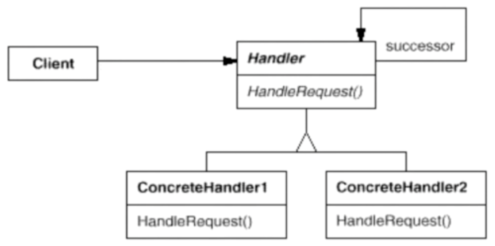

# 责任链模式

责任链模式是一种行为设计模式，允许你将请求沿着处理者链进行发送。收到请求后，每个处理者均可对请求进行处理，或将其传递给链上的下个处理者。

## 示意图



## 示例代码

以处理请求为例，我们创建一个处理请求的链。每个处理器可以决定是否能够处理该请求，如果不能则将请求传递给下一个处理器。

```ts
interface Request {
  type: string;
}

abstract class ChainHandler {
  private nextHandler?: ChainHandler;

  private sendRequestToNextHandler(request: Request): void {
    if (this.nextHandler) {
      this.nextHandler.handle(request);
    }
  }

  protected abstract canHandleRequest(request: Request): boolean;

  protected abstract processRequest(request: Request): boolean;

  public setNext(handler: ChainHandler) {
    this.nextHandler = handler;
  }

  public handle(request: Request) {
    if (this.canHandleRequest(request)) {
      return this.processRequest(request);
    } else {
      return this.sendRequestToNextHandler(request);
    }
  }
}

class ConcreteHandler1 extends ChainHandler {
  protected canHandleRequest(request: Request): boolean {
    return request.type === 'A';
  }

  protected processRequest(request: Request): boolean {
    console.log('Handling request with ConcreteHandler1');
    return true;
  }
}

class ConcreteHandler2 extends ChainHandler {
  protected canHandleRequest(request: Request): boolean {
    return request.type === 'B';
  }
  protected processRequest(request: Request): boolean {
    console.log('Handling request with ConcreteHandler2');
    return true;
  }
}

const handler1 = new ConcreteHandler1();
const handler2 = new ConcreteHandler2();

handler1.setNext(handler2);
handler1.handle({ type: 'A' });
```

## 优缺点

### 优点

- 可以避免请求发送者与多个接受者耦合在一起；
- 可以动态地新增或者删除责任。

### 缺点

- 调试会比较困难，尤其是链条比较长的时候；
- 可能存在过多的请求没有被处理的情况。

## 使用场景

应用场合在于“一个请求可能有多个接受者，但是最后真正的接受者只有一个”，这时候请求发送者与接受者的耦合有可能出现“变化脆弱”的症状，职责链的目的就是将二者解耦，从而更好地应对变化。

## 参考

- [责任链设计模式（职责链模式）](https://refactoringguru.cn/design-patterns/chain-of-responsibility)
