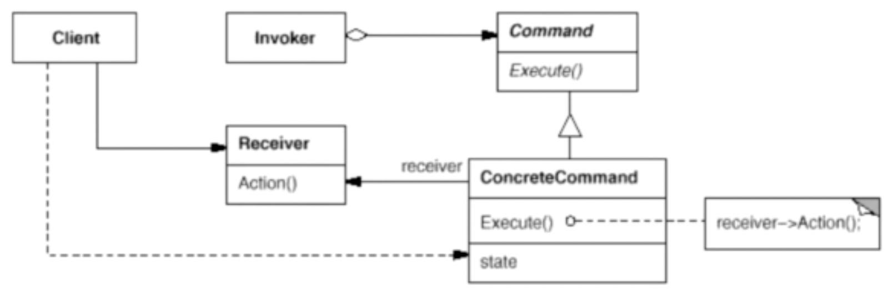

# 命令模式

命令模式将一个请求封装为一个对象，从而使你可以用不同的请求对客户进行参数化，对请求排队或记录请求日志，以及支持可撤销的操作。

大白话理解：

- 核心就是将请求封装为一个对象，通过管理这个对象来实现不同的操作（如何管理并没有明确的要求，可以管理一组命令列表依次执行，也可以组合命令形成新的命令，又或者定义不用的行为，每个行为对分别调用不同的命令），从而实现命令发送者与接收者的解耦。
- 以电视遥控器举例，遥控器就是一个命令发送者，电视机就是接收者，遥控器不会直接控制电视机，而是通过遥控器内部的命令对象来控制。其中每个命令可以拿到电视机对象，从而实现不同的操作。

## 示意图



## 示例代码

```ts
interface Command {
  name: string;
  execute(): void;
}

class ConcreteCommand implements Command {
  private receiver: Receiver;

  constructor(receiver: Receiver) {
    this.receiver = receiver;
  }

  execute() {
    this.receiver.action();
  }
}

// 接收者角色
class Receiver {
  action() {
    console.log('执行操作');
  }
}

// 调用者角色
class Invoker {
  private commands: Command[] = [];

  addCommand(command: Command) {
    this.commands.push(command);
  }

  action() {
    for (const command of this.commands) {
      command.execute();
    }
  }
}

// use case
const receiver = new Receiver();
const command = new ConcreteCommand(receiver);
const invoker = new Invoker();

invoker.addCommand(command);
invoker.action();
```

## 优缺点

### 优点

- 降低系统的耦合度（将行为请求者和行为实现者解耦）；
- 新的命令可以很容易地加入到系统中去，即增加具体的命令类即可，具有较好的可扩展性；
- 可以比较容易地设计一个命令队列或宏命令（组合命令）；
- 可以方便地实现对请求的撤销和恢复操作。

### 缺点

- 使用命令模式可能会导致某些系统有过多的具体命令类。因为针对每一个对请求调用者传来的请求，都需要设计一个具体的命令类与之对应。

## 使用场景

- 系统需要将请求调用者和请求接收者解耦，使得调用者和接收者不直接交互。
- 系统需要在不同的时刻指定、执行、删除请求。
- 系统需要支持命令的撤销操作和恢复操作。
- 系统需要将一组操作组合在一起，即宏命令。
