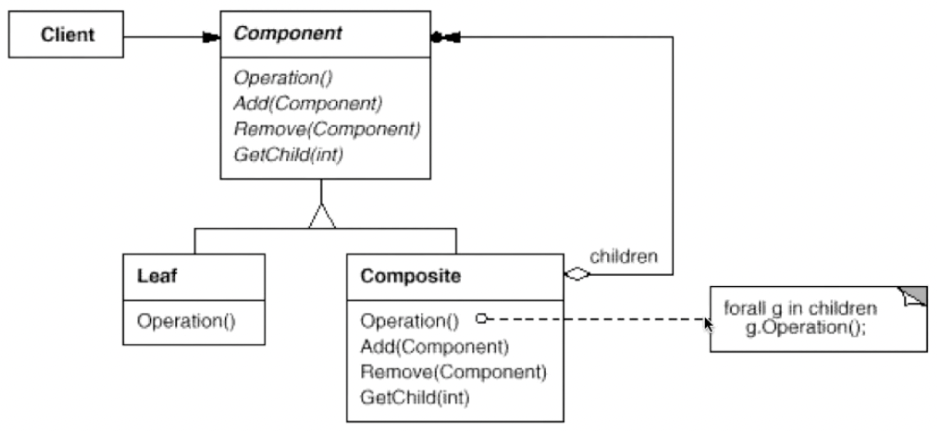

# 组合模式

将对象组合成树形结构以表示“部分-整体”的层次结构。Composite 使得用户对单个对象和组合对象的使用具有一致性（稳定）。

## 示意图



## 示例代码

```typescript
interface Component {
  operation(): void;
}

class Leaf implements Component {
  public operation() {
    console.log('Leaf');
  }
}

class Composite implements Component {
  private children: Array<Component> = [];

  public add(child: Component) {
    this.children.push(child);
  }

  public remove(child: Component) {
    const index = this.children.indexOf(child);

    if (index !== -1) {
      this.children.splice(index, 1);
    }
  }

  public operation() {
    for (const child of this.children) {
      child.operation();
    }
  }
}

// usage
const root = new Composite();
const leaf = new Leaf();
root.add(leaf);
root.operation();
```

## 优缺点

### 优点

- 可将一对多的关系转化为一对一的关系，使得客户端代码可以一致地处理对象和对象的组合。
- 可以让父对象中的子对象反向追溯，如果父对象有频繁的遍历操作，可使用缓存来进行优化。

### 缺点

- 设计变得更加复杂。
- 不容易限制组合中的组件类型。

## 使用场景

- 在图形编辑器中实现一系列的几何图形的绘制功能。

## 参考

- [组合设计模式](https://refactoringguru.cn/design-patterns/composite)
