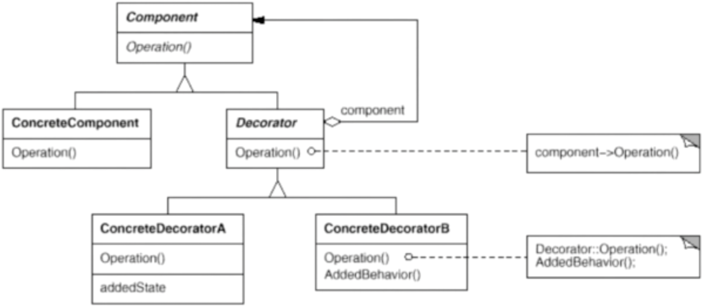

# 装饰器模式

动态地给一个对象增加一些额外的职责，就增加对象功能来说，装饰模式比生成子类实现更为灵活。

## 示意图



## 示例代码

```ts
interface Component {
  operation(): void;
}

class ConcreteComponent implements Component {
  operation() {
    console.log('具体对象的操作');
  }
}

class Decorator implements Component {
  private component: Component;

  constructor(component: Component) {
    this.component = component;
  }

  operation() {
    this.component.operation();
  }
}

class ConcreteDecorator extends Decorator {
  operation() {
    super.operation();
    // 具体装饰对象的行为...
  }
}

// use case
const component = new ConcreteComponent();
const decoratorA = new ConcreteDecoratorA(component);

decoratorA.operation();
```

## 优缺点

### 优点

- 比静态继承更灵活，可以动态地扩展对象的功能。
- 具体构件类与具体装饰类可以独立变化，用户可以根据需要增加新的具体构件类和具体装饰类，在使用时再对其进行组合，原有代码无须改变。

### 缺点

- 多层装饰会比较复杂。
- 难以排除多个装饰器带来的副作用。

## 使用场景

- 扩展对象的功能。
- 按层次给类增加职责，替代继承关系。
