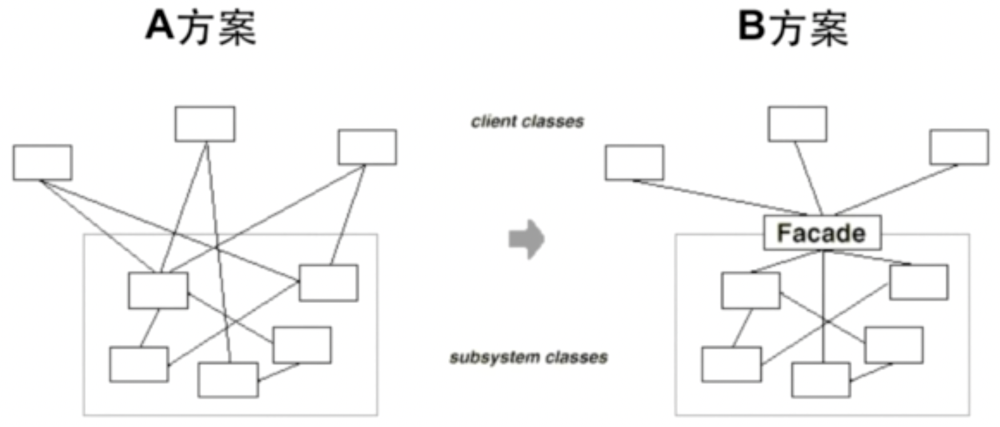

# 外观模式

为子系统中的一组接口提供一个一致（稳定）的界面，Facade 模式定义了一个高层接口，这个接口使得这一子系统更加容易使用（复用）。

## 示意图

为一个复杂的子系统提供一个一致的高层接口。这样，客户端代码就可以通过这个简化的接口与子系统交互，而不需要了解子系统内部的复杂性。



## 示例代码

```ts
interface SubSystem1 {
  operation1(): void;
}
interface SubSystem2 {
  operation2(): void;
}
class SubSystem1Impl implements SubSystem1 {
  public operation1() {}
}
class SubSystem2Impl implements SubSystem2 {
  public operation2() {}
}
class Facade {
  private subSystem1: SubSystem1;
  private subSystem2: SubSystem2;

  constructor() {
    this.subSystem1 = new SubSystem1Impl();
    this.subSystem2 = new SubSystem2Impl();
  }

  public operation() {
    this.subSystem1.operation1();
    this.subSystem2.operation2();
  }
}
class Client {
  public operation() {
    const facade = new Facade();

    facade.operation();
  }
}

// use case
const client = new Client();

client.operation();
```

## 优缺点

### 优点

- 它对客户屏蔽了子系统组件，因而减少了客户处理的对象数目并使得子系统使用更加容易。
- 子系统的内部变化不会影响客户端。

### 缺点

- 不符合开闭原则，添加新的子系统可能需要修改 Facade 类或客户端的代码。

## 使用场景

- 当你需要构建一个层次结构的子系统时，使用 Facade 模式定义子系统中每层的入口。
