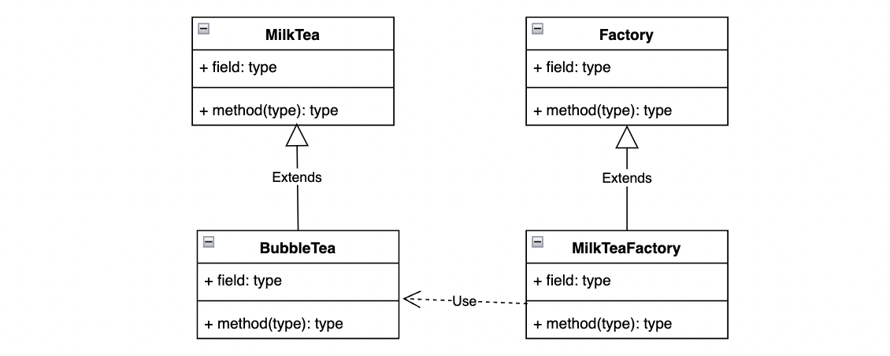

# 工厂方法模式

在工厂方法模式中，工厂父类负责定义创建对象的公共接口，而工厂子类则负责生成具体的产品对象。

## 示意图



## 示例代码

```typescript
abstract class MilkTea {}

class BubbleTea extends MilkTea {}

class FruitTea extends MilkTea {}

abstract class MilkTeaFactory {
  abstract create(): MilkTea;
}

class BubbleTeaFactory extends MilkTeaFactory {
  create(): BubbleTea {
    return new BubbleTea();
  }
}

class FruitTeaFactory extends MilkTeaFactory {
  create(): FruitTea {
    return new FruitTea();
  }
}

// usage
function makeMilkTea(factory: MilkTeaFactory): void {
  const milkTea = factory.create();
}
```

## 优缺点

### 优点

- **封装性**：隐藏了产品的具体实现，使得新增产品类时不需要修改抽象工厂和抽象产品提供的接口，无须修改客户端，也无须修改其他的具体工厂和具体产品。
- **扩展性**：易于增加新的产品类型，只需添加相应的子类和对应的工厂即可。

### 缺点

- 每新增一个产品，就需要新增一个对应的工厂类和产品类，在一定程度上增加了系统的复杂度。

## 应用场景

- 当系统中有许多种类型的对象，但这些对象的创建方式相似时，可以考虑使用工厂方法模式。
