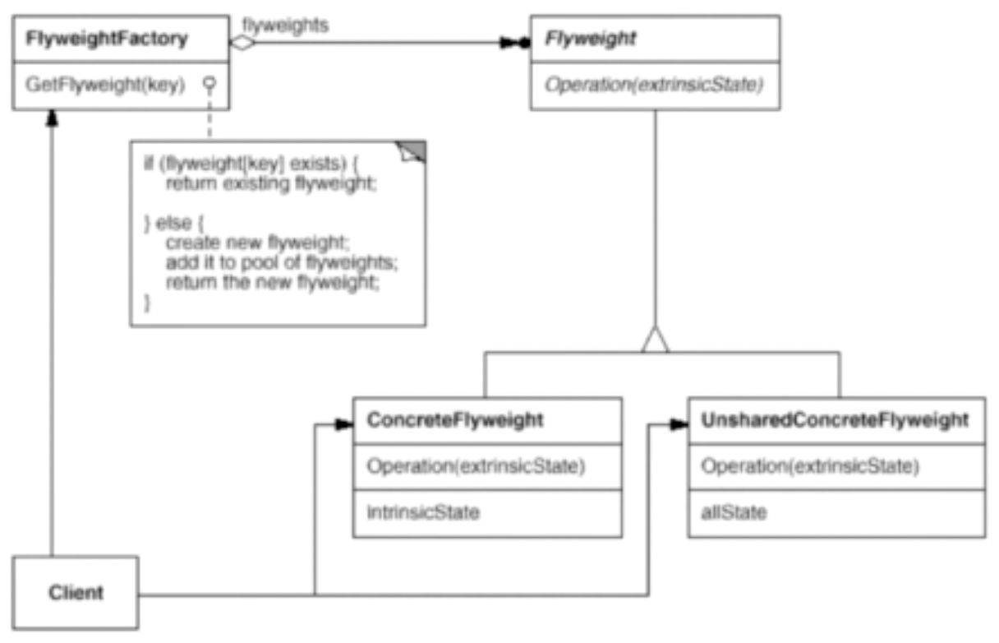

# 享元模式

享元模式（Flyweight Pattern）运用共享技术有效地支持大量细粒度对象的复用。

## 示意图



## 示例代码

```ts
interface Flyweight {
  operation(): void;
}

class ConcreteFlyweight implements Flyweight {
  operation(): void {}
}

class FlyweightFactory {
  private flyweights: Map<string, Flyweight> = new Map();

  getFlyweight(key: string): Flyweight {
    if (!this.flyweights.has(key)) {
      const flyweight = new ConcreteFlyweight();

      this.flyweights.set(key, flyweight);
    }

    return this.flyweights.get(key)!;
  }
}
```

## 优缺点

### 优点

- 大大减少对象的创建，降低内存的占用情况。

### 缺点

- 提高了系统的复杂度，需要分离出外部状态和内部状态。

## 使用场景

- 系统中有大量相同或者相似的对象，由于这类对象的大量使用，造成内存的大量耗费。
