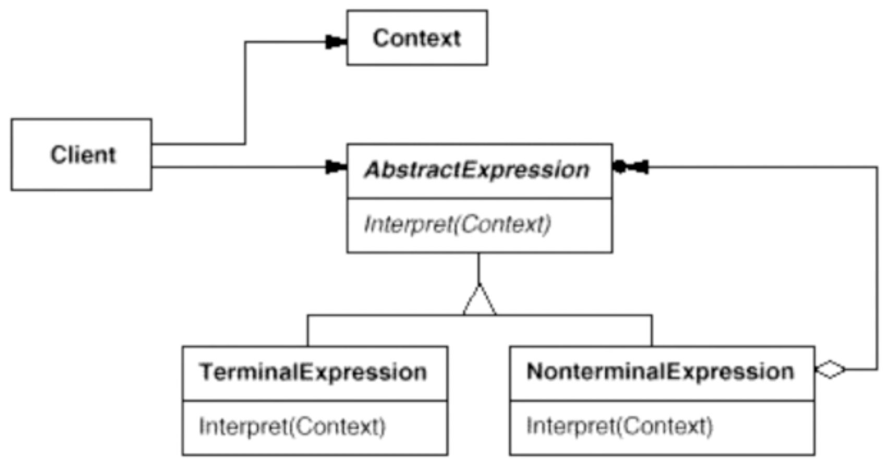

# 解释器模式

给定一个语言，定义它的文法的一种表示，并定义一种解释器，这个解释器使用该表示来解释语言中的句子。

## 示意图



## 示例代码

```ts
// 输入字符串 "a+b",通过解析模式实现解析，并传递 a=2,b=3 进行验证实现方案是否正确
class Context {
  private map: Map<string, number> = new Map();

  public lookup(key: string) {
    return this.map.get(key);
  }
  public assign(key: string, value: number) {
    this.map.set(key, value);
  }
  public free() {
    this.map.clear();
  }
}

interface Expression {
  interpret(context: Context): any;
}

class VariableExpression implements Expression {
  constructor(private name: string) {}

  public interpret(context: Context) {
    return context.lookup(this.name);
  }
}

class PlusExpression implements Expression {
  public interpret(context: Context, left: Expression, right: Expression) {
    return left.interpret(context) + right.interpret(context);
  }
}

// use case
const context = new Context();
context.assign('a', 2);
context.assign('b', 3);
const expression: Expression = new PlusExpression(
  new VariableExpression('a'),
  new VariableExpression('b')
);
console.log(`expression result is ${expression.interpret(context)}`);
```

## 优缺点

### 优点

- 易于改变和扩展。增加新的解释表达式很好。

### 缺点

- 对于简单的语法来说，使用这种模式可能会比直接“硬编码”执行语言的文法规则更复杂。

## 使用场景

- 在软件构建过程中，如果某一特定领域的问题比较复杂，类似的结构不断重复出现，如果使用普通的编程方式来实现将面临非常频繁的变化。
