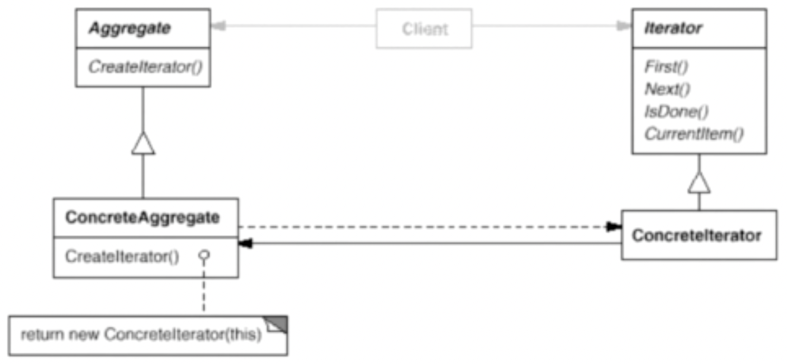

# 迭代器模式

迭代器模式提供一种方法顺序访问一个聚合对象中的各个元素，而又不暴露其内部的表示。

## 示意图



## 示例代码

```ts
interface Iterator<T> {
  first(): T;
  currentItem(): T;
  next(): T;
  isDone(): boolean;
}

class ConcreteIterator implements Iterator<number> {
  private index: number;

  constructor(private items: Array<number>) {
    this.index = 0;
  }

  first(): number {
    return this.items[0];
  }

  currentItem(): number {
    return this.items[this.index];
  }

  next(): number {
    const retVal = this.items[this.index];

    this.index += 1;

    return retVal;
  }

  isDone(): boolean {
    return this.index >= this.items.length;
  }
}
```

## 优缺点

### 优点

- 访问一个聚合对象的内容而无需暴露它的内部表示。
- 为遍历不同的聚合结构提供一个统一的接口（即支持多态迭代）。

### 缺点

- 遍历的同时更改聚合对象可能会引发问题。
- 对于某些特殊集合，使用迭代器可能比直接遍历的效率低。

## 使用场景

- 当集合背后为复杂的数据结构，且希望对客户端隐藏其复杂性时（出于使用便利性或安全性的考虑），可以使用迭代器模式。
