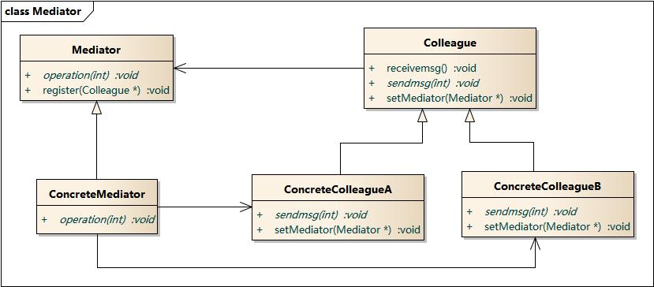

# 中介者模式

中介者模式（Mediator Pattern）定义：用一个中介对象来封装一系列的对象交互，中介者使各对象不需要显式地相互引用，从而使其耦合松散，而且可以独立地改变它们之间的交互。

> 中介者模式又称为调停者模式，它是一种对象行为型模式。

## 示意图



## 示例代码

```typescript
// 中介者接口，定义了中介者的基本操作。
interface Mediator {
  notify(name: string, message: string): void;
}

class ConcreteMediator implements Mediator {
  colleagueMap: Map<string, Colleague> = new Map();

  setColleague(name: string, colleague: Colleague) {
    this.colleagueMap.set(name, colleague);
  }

  notify(name: string, message: string): void {
    this.colleagueMap.get(name)?.receiveMessage(message);
  }
}

// 定义了与中介者交互的方法。
interface Colleague {
  notify(name: string, message: string): void;
  receiveMessage(message: string): void;
}

class ConcreteColleague implements Colleague {
  mediator: Mediator;
  name: string;

  constructor(mediator: Mediator, name: string) {
    this.mediator = mediator;
    this.name = name;
  }

  notify(name: string, message: string): void {
    this.mediator.notify(name, message);
  }

  receiveMessage(message: string): void {
    console.log(`${this.name} received a message: ${message}`);
  }
}

const mediator = new ConcreteMediator();
const colleague1 = new ConcreteColleague(mediator, 'Colleague 1');
const colleague2 = new ConcreteColleague(mediator, 'Colleague 2');

mediator.setColleague('colleague1', colleague1);
mediator.setColleague('colleague2', colleague2);
colleague1.notify('colleague2', 'Hello from Colleague 1');
```

## 优缺点

### 优点

- 降低了类之间的耦合度，每个类仅需要知道中介者对象而无需了解其他类的细节。
- 可以控制各个类之间的交互，使得系统的管理更加集中和统一。

### 缺点

- 耦合并没有消失，而是被集中到了中介者上，所以中介者会成为系统中较为复杂的部分，中介者的复杂程度将随着参与者数量的增加而指数级增长。
- 如果设计不当，中介者可能会变成“上帝”对象，它几乎完全掌握了系统中的所有逻辑与流程，这会使系统难以维护。

## 使用场景

- 系统中对象之间存在复杂的引用关系，导致它们之间的依赖关系结构混乱且难以理解。

## 参考

- [中介者模式 — Graphic Design Patterns](https://design-patterns.readthedocs.io/zh-cn/latest/behavioral_patterns/mediator.html)
