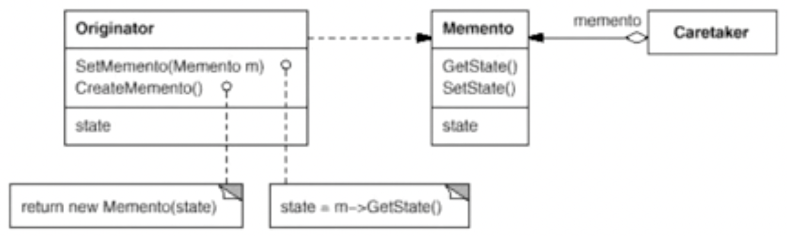

# 备忘录模式

在不破坏封装性的前提下，捕获一个对象的内部状态，并在该对象之外保存这个状态。这样以后就可以将该对象恢复到原先保存的状态。

## 示意图



## 示例代码

```ts
interface Memento {
  getState(): string;
  setState(state: string): void;
}

class ConcreteMemento implements Memento {
  private state: string;

  constructor(state?: string) {
    this.state = state || '';
  }

  getState(): string {
    return this.state;
  }

  setState(state: string): void {
    this.state = state;
  }
}

class Originator {
  private state: string;

  createMemento(): Memento {
    return new ConcreteMemento(this.state);
  }

  setMemento(m: Memento): void {
    this.state = m.getState();
  }
}

// use case
const originator = new Originator();
const memento = originator.createMemento();

// ...

originator.setMemento(memento);
```

## 优缺点

### 优点

- 可以在不破坏对象封装情况的前提下创建对象状态快照，并在必要时恢复。
- 可将封装在备忘录中的状态信息传递给其他对象，而不会暴露对象的实现细节。

### 缺点

- 需要消耗大量的内存来存储对象的状态。
- 大多数情况下，备忘录模式仅仅适用于命令模式的场景中。

### 使用情景

- 当必须保存一个对象在某一个时刻的全部或部分状态，这样以后需要时才能恢复到先前的状态时，可以使用该模式。
- 一个对象需要提供操作历史记录的功能，可以撤销操作到之前的状态时，可以使用该模式。
