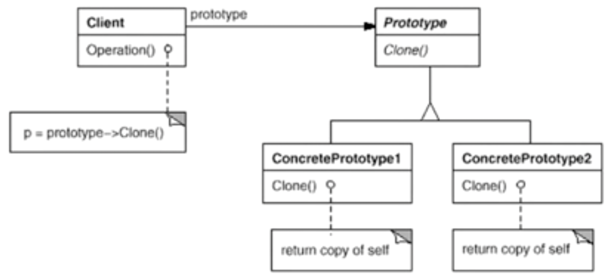

# 原型模式

使用原型实例指定创建对象的种类，然后通过拷贝这些原型来创建新的对象。

## 示意图



## 示例代码

```ts
interface Prototype {
  clone(): Prototype;
  operation(): void;
}

class ConcretePrototype implements Prototype {
  clone(): Prototype {
    return Object.assign(Object.create(this), JSON.parse(JSON.stringify(this)));
  }

  operation(): void {}
}

class Application {
  prototype: Prototype;

  constructor(prototype: Prototype) {
    this.prototype = prototype;
  }

  operation(): void {
    const cloned = this.prototype.clone();

    cloned.operation();
  }
}

// use case
const prototype = new ConcretePrototype();
const app = new Application(prototype);

app.operation();
```

## 优缺点

### 优点

- 可以使用原型实例指定创建对象的种类，通过拷贝这些原型来创建新的对象。

### 缺点

- 原型模式需要实现克隆操作，需要实现 clone 接口。
- 克隆方法可能会涉及到复杂的逻辑，例如循环引用、对象的序列化和反序列化等，这会增加代码的复杂度。

## 使用场景

- 当需要创建大量相似对象时，可以使用原型模式来避免重复的初始化过程。
- 当对象的构造过程比较复杂或者耗时时，可以通过克隆已有的实例来快速生成新的对象。
