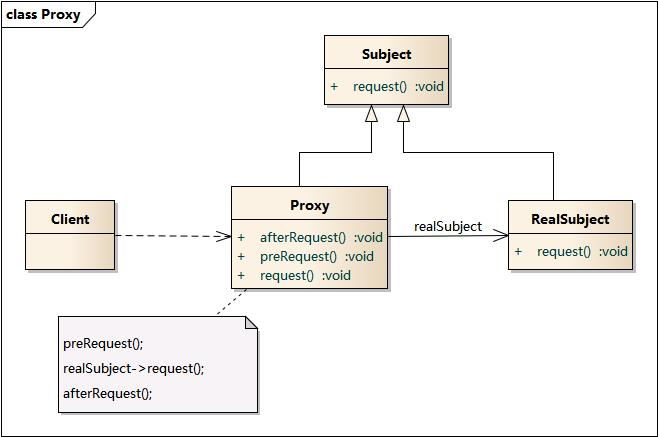

# 代理模式

代理模式（Proxy Pattern）给某一个对象提供一个代 理，并由代理对象控制对原对象的引用。

> 代理模式是一种对象结构型模式。

## 示意图



## 示例代码

```typescript
interface Subject {
  request(): void;
}

class RealSubject implements Subject {
  public request() {
    console.log('RealSubject: Handling Request.');
  }
}

class Proxy implements Subject {
  private realSubject: RealSubject;

  constructor(realSubject?: RealSubject) {
    this.realSubject = realSubject || new RealSubject();
  }

  public request() {
    this.realSubject.request();
  }
}

// usage
const proxy = new Proxy();

proxy.request();
```

## 优缺点

### 优点

- 能够控制对原始对象的访问。
- 可以隐藏原始对象，从而在客户端和目标对象之间建立一个间接层，这样就能够将客户端与目标对象分离，在一定程度上降低了系统的耦合度。

### 缺点

- 由于在客户端和真实主题之间增加了代理对象，因此有些类型的代理模式可能会造成请求的处理速度变慢，例如：调试跟踪型的代理模式。

## 使用场景

- 在面向对象系统中，有些对象由于某种原因（比如对象创建开销很大，或者需要安全控制等）直接访问会给使用者或者系统结构带来很多麻烦，通过一个称之为“代理”的第三者来实现间接引用，这样可以在不修改原有系统结构的基础上引入新的系统行为。

## 参考

- [代理模式 — Graphic Design Patterns](https://design-patterns.readthedocs.io/zh-cn/latest/structural_patterns/proxy.html)
