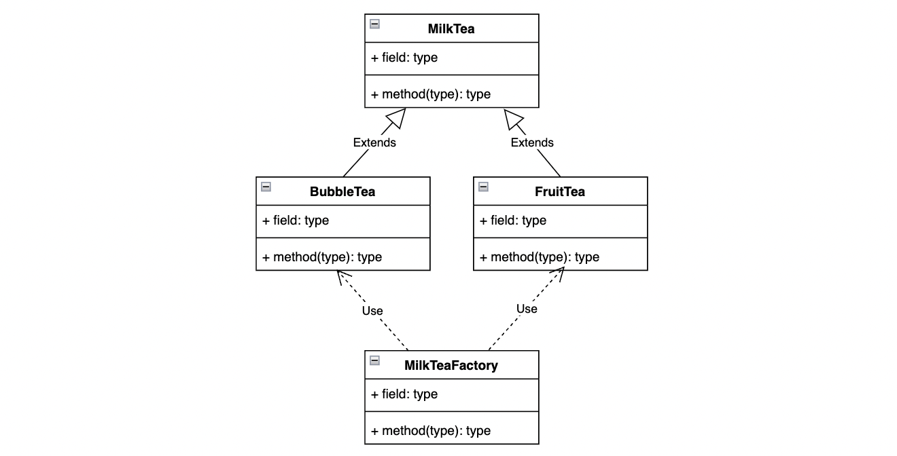

# 简单工厂模式

在简单工厂模式中，可以根据参数的不同返回不同类的实例。

简单工厂模式专门定义一个类来负责创建其他类的实例，被创建的实例通常都具有共同的父类。

## 示例图



## 示例代码

```typescript
abstract class MilkTea {}

class BubbleTea extends MilkTea {}

class FruitTea extends MilkTea {}

class MilkTeaFactory {
  static getInstance(className: string) {
    switch (className) {
      case 'BubbleTea':
        return new BubbleTea();
      case 'FruitTea':
        return new FruitTea();
      default:
        return null;
    }
  }
}
```

## 优缺点

### 优点

- 工厂类负责决定在什么情况下创建哪一个类的实例，客户端仅负责使用，实现职责分离，以降低系统的耦合度；
- 创建对象无需知道具体的类名，只需要知道具体产品类所对应的参数即可。

### 缺点

- 工厂类的职责相对过重，随着产品类的不断增多，在一定程序上增加了系统的复杂度和理解难度；
- 每次增加新产品时都需要修改工厂逻辑，违背了“开闭原则”。

## 使用场景

在软件开发中经常遇到应用需要创建的对象，一般至少有两种，一个抽象基类和多个不同的子类。如：

- 数据库驱动对象；
- 错误信息类。
