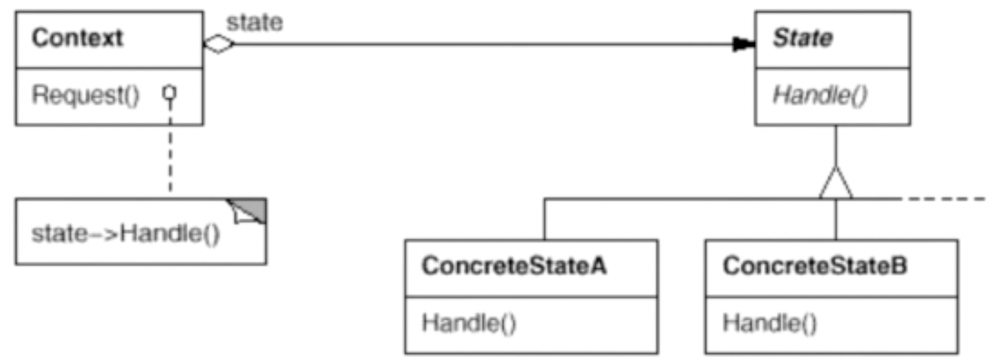

# 状态模式

状态模式允许一个对象在其内部状态改变时改变它的行为，对象看起来似乎修改了它的类。其别名为状态对象。

## 示意图



## 示例代码

```ts
abstract class NetworkState {
  nextState?: NetworkState;

  abstract operation1(): void;
  abstract operation2(): void;
  abstract operation3(): void;
  // ...
}

class OpenState extends NetworkState {
  private static instance?: NetworkState;
  static getInstance() {
    if (!this.instance) {
      this.instance = new this();
    }

    return this.instance;
  }

  operation1() {
    // do something
    this.nextState = CloseState.getInstance();
  }

  operation2() {
    // do something
    this.nextState = ConnectedState.getInstance();
  }

  operation3() {
    // do something
    this.nextState = OpenState.getInstance();
  }
}

class CloseState extends NetworkState {
  /* ... */
}
class ConnectedState extends NetworkState {
  /* ... */
}

class NetworkProcessor {
  private state: NetworkState;

  constructor(state: NetworkState) {
    this.state = state;
  }

  operation1() {
    // do something
    this.state.operation1();
    this.state = this.state.nextState;
    // do something
  }

  operation2() {
    // do something
    this.state.operation2();
    this.state = this.state.nextState;
    // do something
  }

  operation3() {
    // do something
    this.state.operation3();
    this.state = this.state.nextState;
    // do something
  }
}
```

## 优缺点

### 优点

- 将特定状态的相关行为局部化，并且将不同状态的行为分割开来；
- 允许对象在运行时根据状态改变它的行为。

### 缺点

- 状态模式的使用必然会增加系统的类与对象的个数；
- 状态的切换要执行许多操作，而且各个状态的行为相差不大时会带来许多相似类的膨胀问题；
- 状态模式的结构与实现都较为复杂，如果使用不当会导致程序结构和代码的混乱。

## 使用场景

在软件构建过程中，某些对象的状态如果改变，其行为也会随之而发生变化，比如文档处于只读状态，其支持的行为和读写状态支持的行为就可能完全不同。

如何在运行时根据对象的状态来透明地更改对象的行为？而不会为对象操作和状态转化之间引入紧耦合？
