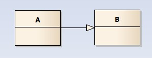
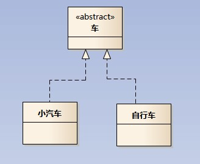
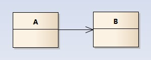
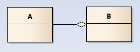
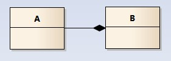
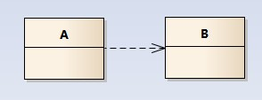
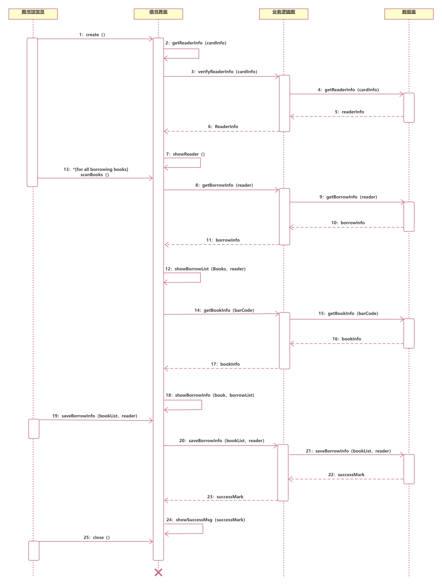

# UML 类图和时序图

UML 类图是软件工程中不可或缺的一部分，它是一种静态结构图，用于展示系统中类的内部结构及类之间的关系。

## 类图的组成部分

类图由以下几个组成部分组成：

- 类名：类的名称
- 属性：类的属性
- 方法：类的方法
- 关系：类之间的关系

属性和方法前面可以有可见性修饰符，例如：

- `+`：表示 public
- `#`：表示 protected
- `-`：表示 private
- `~`：表示 package-private

## 类之间的关系

类之间的关系主要包含有六种。

### 泛化（Generalization）

表示一个类是另一个类的子类，用一条带三角箭头的实线表示。

如下图表示（A 继承自 B）：

### 实现（Realization）

表示一个类实现了一个接口，用一条带三角箭头的虚线表示。

### 关联（Association）

表示一个类与另一个类之间的关系，用一条直线表示。

关联关系默认不强调方向，表示对象间相互知道；如果特别强调方向，如下图，表示 A 知道 B，但 B 不知道 A：

在最终代码中，关联对象通常是以成员变量的形式实现的。

### 聚合（Aggregation）

与组合关系一样，同样表示整体由部分构成的语义，用一条带空心菱形的直线表示。

::: info

整体和部分不是强依赖的，即使整体不存在了，部分仍然存在；例如， 部门撤销了，人员不会消失，他们依然存在。

:::

### 组合（Composition）

表示一个类包含另一个类的实例，用一条带实心菱形的直线表示。

::: info

组合关系是一种强依赖的特殊聚合关系，如果整体不存在了，则部分也不存在了。例如，公司由多个部门组成。

:::

### 依赖（Dependency）

表示一个类依赖于另一个类，用一条带箭头的虚线表示。

如下图表示 A 依赖于 B：

::: info

依赖关系是临时性的关系，在最终代码中，通常表现为某个类的方法的参数使用了另外一个类的对象，箭头的指向为调用关系。

:::

## 时序图

时序图是一种用来展示对象之间交互的图，它描述了对象之间的消息传递顺序。

时序图包括的建模元素主要有：

- 角色(Actor)：表示参与者，用一个人形图标表示。
- 对象(Object)：表示系统中的对象，用一个矩形图标表示。对象的命名方式一般有三种（名称下面都有下划线）：
  - 对象名和类名；
  - 只显示对象名，不显示类名；
  - 只显示类名，不显示对象，即为一个匿名类。

- 生命线（Lifeline）：表示对象的生命周期，用一条竖直的虚线表示。
- 控制焦点（Focus of control）：表示对象执行操作的时刻，以一个很窄的矩形表示。
- 消息（Message）：表示对象之间的交互，主要有五种：
  - 简单消息：泛指对象之间的任何消息调用或发送，而不必关心是异步还是同步的；
  - 同步消息：对象发送消息后，需要接收消息的对象响应完毕并返回消息时才会进行其余的工作；
  - 异步消息：对象发送消息后，不需要接收消息的对象响应完毕并返回消息时就会进行其余的工作；
  - 自返消息：是简单消息的一种，不过是对象向自己发送消息。
  - 返回消息。

下面是一个图书馆借阅系统时序图的例子：

## 作图工具

UML 类图和时序图的工具主要有：

- [draw.io](https://app.diagrams.net/)
- [PlantUML](https://plantuml.com/zh/)
- [ProcessOn](https://www.processon.com/)
- [StarUML](https://staruml.io/)

## 总结

UML 类图和时序图是软件工程中不可或缺的一部分，它们可以帮助我们更好地理解系统的结构和行为，从而提高系统的可维护性和可扩展性。

在实际开发中，我们可以根据具体的需求来选择合适的 UML 类图和时序图，从而更好地完成系统的设计和开发。

## 参考

- [看懂 UML 类图和时序图 — Graphic Design Patterns](https://design-patterns.readthedocs.io/zh-cn/latest/read_uml.html)
- [java - 终于明白六大类 UML 类图关系了 - 个人文章 - SegmentFault 思否](https://segmentfault.com/a/1190000021317534)
- [『这就是 UML！』系列内容第 7 讲：时序图 - ProcessOn 知识社区](https://www.processon.com/knowledge/sequencediagram)
