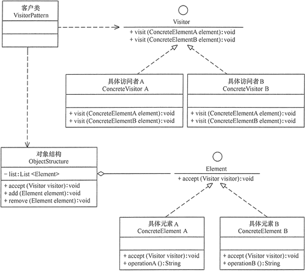

# 访问者模式

访问者模式（Visitor Pattern）提供一个作用于某对象结构中的各元素的操作表示，它使我们可以在不改变各元素的类的前提下定义作用于这些元素的新操作。

> 访问者模式是一种对象行为型模式。

## 示意图



## 示例代码

```typescript
class Visitor {
  visitElementA(element: Element): void;
  visitElementB(element: Element): void;
}

class Element {
  accept(visitor: Visitor): void;
}

class ConcreteElementA extends Element {
  accept(visitor: Visitor) {
    visitor.visitElementA(this);
  }
}

class ConcreteElementB extends Element {
  accept(visitor: Visitor) {
    visitor.visitElementB(this);
  }
}

class ConcreteVisitor1 extends Visitor {
  visitElementA(element: Element) {
    console.log('ConcreteVisitor1 visits ConcreteElementA');
  }
  visitElementB(element: Element) {
    console.log('ConcreteVisitor1 visits ConcreteElementB');
  }
}

class ConcreteVisitor2 extends Visitor {
  visitElementA(element: Element) {
    console.log('ConcreteVisitor2 visits ConcreteElementA');
  }
  visitElementB(element: Element) {
    console.log('ConcreteVisitor2 visits ConcreteElementB');
  }
}

class ObjectStructure {
  elements: Element[] = [];

  attach(element: Element) {
    this.elements.push(element);
  }

  detach(element: Element) {
    const index = this.elements.indexOf(element);
    if (index >= 0) {
      this.elements.splice(index, 1);
    }
  }

  accept(visitor: Visitor) {
    for (let i = 0; i < this.elements.length; i++) {
      this.elements[i].accept(visitor);
    }
  }
}

// usage
const structure = new ObjectStructure();
structure.attach(new ConcreteElementA());
structure.attach(new ConcreteElementB());

const visitor1 = new ConcreteVisitor1();
structure.accept(visitor1);

const visitor2 = new ConcreteVisitor2();
structure.accept(visitor2);
```

## 优缺点

### 优点

- 扩展性好。能够在不修改对象结构中元素的情况下，为对象结构中的元素添加新的操作。

### 缺点

- 使得程序复杂化。访问者模式将数据结构和作用于结构上的操作耦合在一起，正确使用访问者模式需要你的系统在设计阶段有很清晰的定义。

## 使用场景

- 由于需求的改变，某些类需要增加新的操作，但是修改原有类又不可能或不希望引入较多的改动。

## 参考

- [访问者设计模式](https://refactoringguru.cn/design-patterns/visitor)
- [23 种设计模式详解 - CSDN 博客](https://blog.csdn.net/A1342772/article/details/91349142)
- [学习并理解 23 种设计模式在《设计模式：可复用面向对象软件的基础》一书中所介绍的 23 种经典设计模式，不过设计模式并 - 掘金](https://juejin.cn/post/6844903795017646094)
